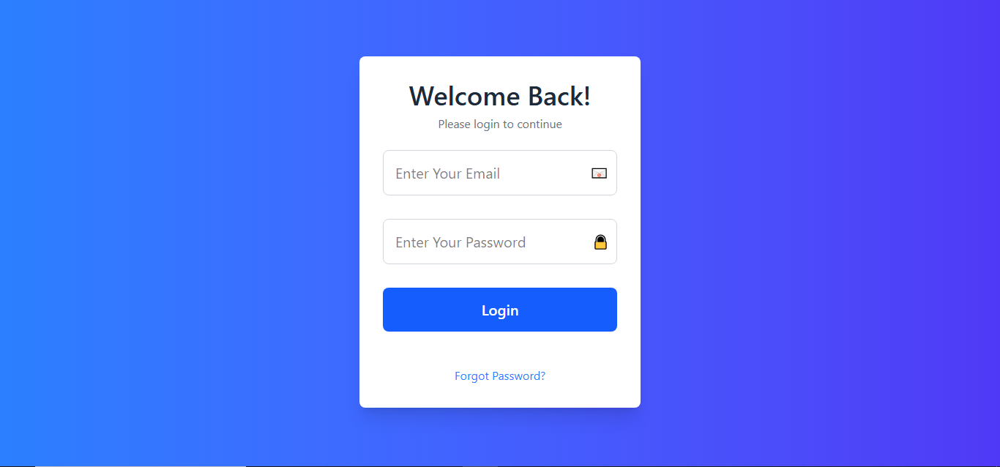
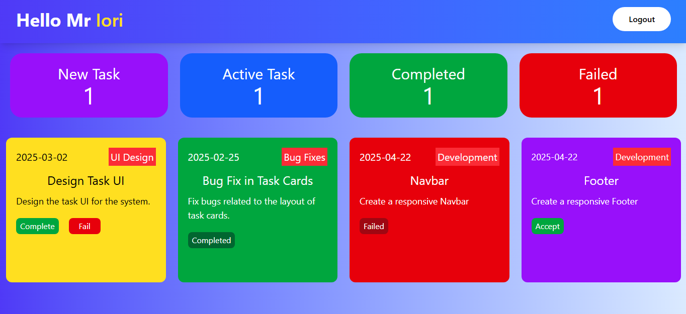
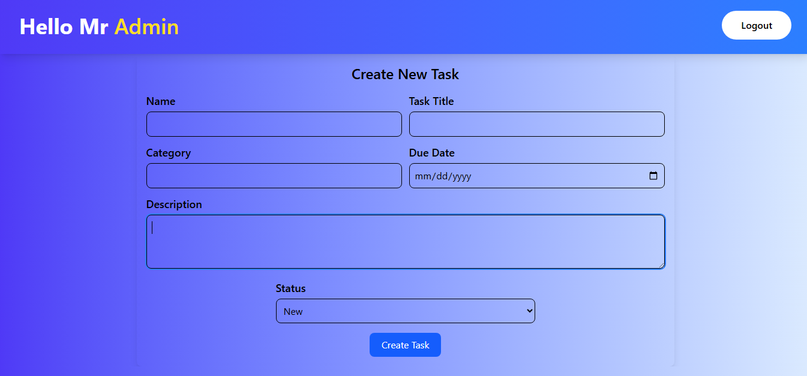

# 🚀 Employee Management System


---

## 📍 Live Demo

🔗 [Click here to visit the live project](https://employee-management-system-two-eosin.vercel.app)

---

## 🧠 Project Overview

The **Employee Management System** is a web-based React application designed to manage employee tasks efficiently.

It includes two roles:
- **Admin** who can assign tasks, and monitor performance.
- **Employee** who can view, accept, and update task status.

All data is stored locally using the browser's `localStorage`, so no backend is required. The app is fully single-page with **no reloads** needed between interactions.

---

## ⚙️ Tech Stack

| Tech           | Description                             |
|----------------|-----------------------------------------|
| ⚛️ React        | Frontend UI Framework                   |
| 🎨 Tailwind CSS | Utility-first CSS framework             |
| 💾 LocalStorage | For client-side data persistence        |
| 🚫 No Reload    | SPA (Single Page Application) behavior  |

---

## 🔐 User Roles

### 👨‍💼 Admin
- Login via admin credentials
- Assign tasks to employees
- View task list of all employees
- Track how many tasks are:
  - ✅ Completed
  - ❌ Failed
  - ⏳ Pending
- Manage and monitor performance of employees

### 👷‍♂️ Employee
- Login via employee credentials
- View new assigned tasks
- Accept tasks
- Mark tasks as **Completed** or **Failed**
- Only sees tasks assigned to them

---

## 🖼️ Screenshots

### 🔐 Login Page  


### 👷‍♂️ Employee Dashboard  


### 👨‍💼 Admin Dashboard  


---

## 🔧 Features

| Feature                          | Status   |
|----------------------------------|----------|
| Admin & Employee Login           | ✅ Done   |
| Task Assignment by Admin         | ✅ Done   |
| Employee Task Management         | ✅ Done   |
| Task Status Update (Complete/Fail)| ✅ Done   |
| Admin Dashboard with Task Tracking| ✅ Done   |
| LocalStorage Integration         | ✅ Done   |
| No Page Reload (SPA behavior)    | ✅ Done   |
| Responsive Tailwind UI           | ✅ Done   |

---

## 💻 Getting Started

### Prerequisites:
- Node.js (v14 or above)
- npm / yarn

### Steps:

```bash
# Clone the repo
git clone https://github.com/Sannan144/Employee-Management-System.git

# Go to project directory
cd Employee-Management-System

# Install dependencies
npm install

# Run the dev server
npm run dev
